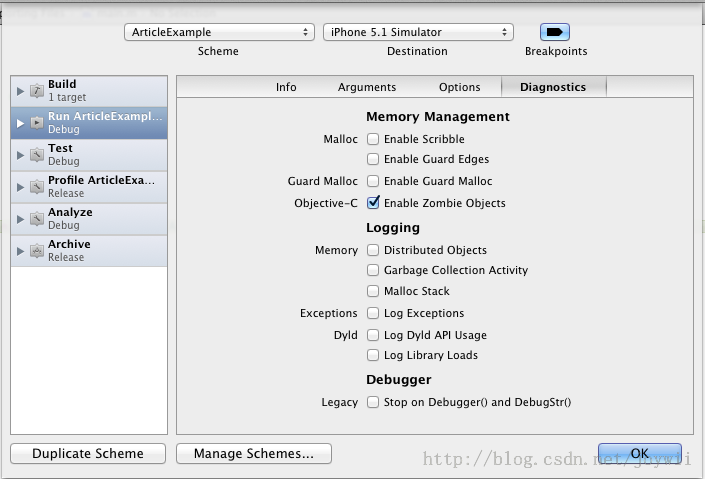

1. Enable NSZombie Objects（开启僵尸对象）   

	Enable NSZombie Objects可能是整个Xcode开发环境中最有用的调试技巧。这个技巧非常非常容易追踪到重复释放的问题。该技巧会以非常简洁的方式打印指出重复释放的类和该类的内存地址。   
	怎么开启僵尸对象呢？首先打开“Edit Scheme”（或者通过热键⌘<），然后选择Diagnostics选项卡，勾选Enable NSZombie Objects选项。

	 
	
	现在我们可以关掉ARC来测试重复释放的问题、异常和更容易产生的Crashs，但是即使开启ARC，重复释放和与内存相关的Crashs也经常发生。现在假设我们犯了一些错误导致了重复释放的发生来观察将要发生什么。
		
		UIView* view = [[[UIView alloc] init] autorelease];
		//...
		//do something with view...clearly forgetting that it has been autoreleased.
		//
		[view release];
	
	
		
####转载说明
* [转载原文:5个Xcode开发调试技巧](http://blog.csdn.net/joywii/article/details/19641931)
* [外文原文](http://crushbeercrushcode.org/2012/11/four-tips-for-debugging-in-xcode-like-a-bro/)

