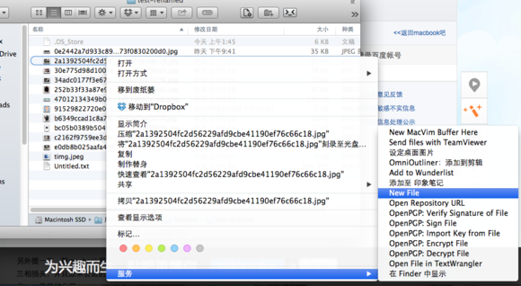
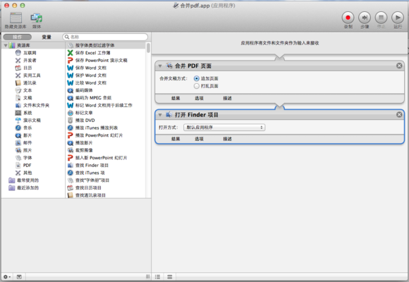

[原文:教程向多图：Automator简明教程和常用工作流](http://tieba.baidu.com/p/3238095038?pn=1)

Automator算是mac里的一种特色功能了。它可以让用户自己设计流程完成一些工作。它应该算是mac系统应用从初级到高级的一个小小的分水岭，虽然吧里很少间到关于它的讨论。

####以下是适合用automator的场景：   
1. 经常用到的操作，比如将网页上的文字保存成文本文件。这些甚至可以设置成快捷键一键完成；
2. 批量操作，比如将图片批量改变大小加水印等等；
3. 自动化操作，比如当文件夹里新增文件时自动改名备份，或者新增图片时自动创建缩略图以便分享上传；或者是到日历上的某一天给某人发邮件、短信提醒等。

Automator另一个特点是，随着系统里软件的增多，它能做的事情也越来越多。比如安装了office之后就多出了许多操作word、ppt文档的动作；安装了pixelmator之后多出了许多操作图片的动作。因此，经常探索Automator，看看有哪些能做的动作也是一件有趣的事情。

Automator的基本用法也比较简单：从左边的列表里找到想要执行的动作，然后拖动到右侧空白区域。如果下一个动作能接受上一个动作的结果（比如“用图片新建pdf”能接受“图片文件”），两个动作就会连接在一起。   

打开Automator后，点击文件菜单上的“新建”，会出现一个选项列表。下面是不同选项的效果。

1. 工作流程：最普通的工作流程，需要打开Automator进行运行。这项是用得最少的一种；
2. 应用程序：保存之后是一个.app的应用程序，可以像其他应用一样双击执行，也可以将其他文件拖动到上面进行操作（比如拖动pdf文件到“pdf到图片”的图标上来将pdf转化为图片文件），用得比较多；
3. 服务：服务一般出现在特定应用程序的主菜单或者右键菜单中。它只在输入符合要求时才显示，比如只接受文件夹的服务只会在邮件点击文件夹的时候才能看到它。下图是两个服务在菜单中的位置    

  

在制作完“保存网页图片”后，在safari中浏览网页即可找到此服务；   

这个“New File”（新建文件）显示在邮件菜单下的“服务”子项里。

服务还有一个好处是可以设置快捷键。这样只需要在键盘上按指定的按键组合即可启动服务。   
在“系统偏好设置”/键盘/快捷键 可以为服务设置快捷键。   

####怎么学习Automator：
新手的话，建议从单个操作的流程开始，比如上面的“从图片创建pdf”。这样很容易产生满足感，并提高进一步使用的兴趣。

使用Automator有（经）时（常）会遇到挫折，请不要灰心丧气，这是正常的。工作流不能用的时候，请注意每一步的输入和输出是否符合要求，也可以在试运行时打开结果面板查看这一步的结果是否准确。

对于老手来说，Automator支持使用Apple Script和bash script，能帮助你完成大量复杂的工作。

下面介绍一些工作流，大家可以照猫画虎做出来自己试试。有些是我自己经常使用的，有些是外国网站上推荐的。   

####一、用图片新建pdf
新建工作流程时记得选择“应用程序”。   
用法：将一些图片选中，拖动到这个图表上，就会生成一个PDF到桌面（或者其他指定的位置上）。分享设计稿就靠它了！   

####二、把pdf转化为图片(应用程序)
把pdf拖到上面化作一堆图片。据说这个可以破除pdf的加密。   

####三、提取PDF中的文字（应用程序）
提取（可以复制文字）的pdf中的文字，做成txt文本文件。之后就可以放在手机和电子书上看了，哈哈。（当然也能做一些其他的事情，比如文本分析等等）   

####四、合并PDF（应用程序）
将两个PDF合并为一个。    

   
####五、保存选中文字到文本文档（服务）
新建文件时注意是服务！！    
在网上看到好文章想保存下来？选中想要的部分，右键，服务，（你起的服务名），搞定。    

####六、保存网页中的全部图片（服务）
看到mb吧上号看的壁纸想全部保存下来？用这个服务就行。    
使用方法：在safari上打开一个网页，然后在菜单上safari->服务->(服务名)   
不过这个不是很令人满意的是会让系统变得卡顿。如果其他人有改进措施的话，请告诉我。

    
####七、批量调整图片大小（应用程序）
也算是常用操作之一吧。喜欢动手的同学可以自己建立一连串的操作，比如先调整大小再加水印（需要pixelmator）之类的。   

####八、自动给文件重命名加时间（文件夹操作）
注意是“文件夹操作”!   
当有文件新增到制定文件夹时，自动复制一份并在文件名上加上今天的日期。

####九、在finder当前文件夹下新增文件（应用程序）
最后来个高级点的，这个用到了Apple Script。    
用法：保存后将图标拖动到finder的工具条上，会变成一个按钮；以后点击这个按钮就会在当前目录下新建空白文本文件。    

####十、（你自己的工作流程）
大家看了之后自己做了哪些工作流程？欢迎分享出来。或者简单谈谈想用Automator做哪些事情吧。    

