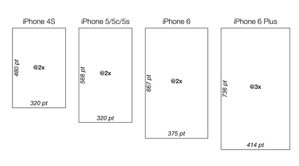
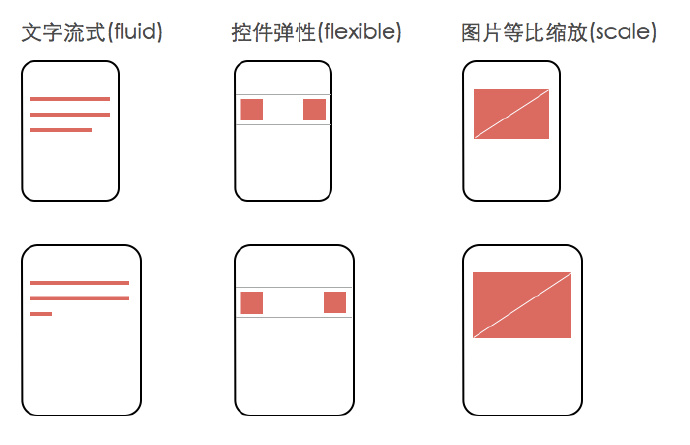

####iPhone/iPad分辨率大全及UI适配
 1. iPhone分辨率参数

	型号 			| 屏幕尺寸 		| 分辨率		| 长宽比
	:----------- 	| :-----------	| :-----------| :-----------
	iPhone			|3.5英寸			|480x320像素	| 3:2 (1.5)
	iPhone 3G/3GS	|3.5英寸			|480x320像素| 3:2 (1.5)
	iPhone 4/4s		|3.5英寸			|960x640像素| 3:2 (1.5)
	iPhone 5/5s		|4英寸			|1136x640像素| 16:9 (1.775)
	iPhone 6		|4.7英寸			|1334×750像素| 16:9 (1.778)
	iPhone 6Plus	|5.5英寸			|1920*1080像素| 16:9 (1.777)
 
 	可以认为iPhone 5/5s、iPhone 6、iPhone 6Plus屏幕长宽比是一样的，可以等比例缩放，虽然有细微的差别，基本上看不出来。   

2. iPad分辨率

	型号 			| 屏幕尺寸 		| 分辨率
	:----------- 	| :-----------	| :-----------
	iPad 1			|9.7英寸			|1024x768像素
	iPad 2			|9.7英寸			|1024x768像素
	new iPad		|9.7英寸			|2048x1536像素
	iPad 4			|9.7英寸			|2048x1536像素
	iPad mini		|7.9英寸			|1024x768像素
	
####iPhone应用所有设计界面只设计两套应该就OK:	
* 一套以iPhone4/4s的960x640设计，即@2x。   
* 一套以最大的分辨率iPhone6+的1920x1080设计,即@3x。

程序中最好保持两套UI切图就可以满足市面上所有的iPhone设备。当然拥有更多的切图也是可以的，程序包的加入的图片越多，程序包就越大，用户下载的体验就差一点。

####只交付一套设计稿，默认用什么规则来适配？
适配策略是先选择iPhone 6作为基准设计尺寸，然后通过一套适配规则自动适配到另外两种尺寸。这套适配规则总结起来就一句话：文字流式，控件弹性，图片等比缩放。

控件弹性指的是，navigation、cell、bar等适配过程中垂直方向上高度不变；水平方向宽度变化时，通过调整元素间距或元素右对齐的方式实现自适应。这样屏幕越大，在垂直方向上可以显示更多内容，发挥大屏幕的优势。

####参考链接
* [APP设计师必读-快速适配iPhone6及plus的诀窍](http://www.ui.cn/project.php?id=25685)
* [适配iPhone6和iPhone6 Plus](http://blog.csdn.net/messageloop3/article/details/39181073)
* [iPhone6分辨率与适配](http://www.cocoachina.com/ios/20140912/9601.html)
* [关于适配iphone6和plus,应用图片的设计问题](http://www.cocoachina.com/bbs/read.php?tid-228023-page-1.html)
* [16比9是最符合人体工学的比例](http://baike.baidu.com/view/750668.htm?fr=aladdin)
* [关于iPhone适配问题说明](http://www.cocoachina.com/ios/20141107/10163.html)
* [iOS 的 APP 如何适应 iPhone 5s/6/6Plus 三种屏幕的尺寸？](http://www.niaogebiji.com/article-4379-1.html)
* [iPhone 6 / 6+出现后，如何改进工作流以实现一份设计稿支持多个尺寸？](http://blog.jobbole.com/80730/)

