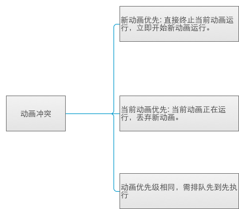

####一. 本地添加新文章
1. 在_posts目录中添加新文章(md或者html)

	名称的统一格式如下:
		
		YEAR-MONTH-DAY-title.MARKUP	
>文件名必须为"年-月-日-文章标题。后缀名"的格式。如果网页代码采用html格式，后缀名为html;如果采用markdown格式，后缀名为md;

		2012-08-25-hello-world.md
		2012-08-25-hello-world.html

2. 使用站点baseurl绝对路径引用本地资源
	
		   

3. 使用相对路径引用本地资源
	
		   

建议使用相对路径引用本地资源，因为这样在_post中使用mou添加新的md文件时,可以直接看到引用的本地资源。在本地使用jekyll serve命令生成网站静态文件,并通过[http://0.0.0.0:4000/](http://0.0.0.0:4000/)访问时也可以看到引用的资源,最后发布到github通过[https://alex520biao.github.io/](https://alex520biao.github.io/)访问时也可以看到引用的资源。

####二.在本地编译部署预览
1. 切换到当前项目
		
		cd /Users/liubiao/github/alex520biao.github.io
2. 运行jekyll命令
		
		jekyll serve	
3. 通过浏览器访问[http://0.0.0.0:4000/](http://0.0.0.0:4000/),即可在浏览本地网站。

####三. 提交并发布到github
4. 本地确认无误之后提交git修改到github,并访问[https://alex520biao.github.io/](https://alex520biao.github.io/),即可看到最新添加的文章。
	