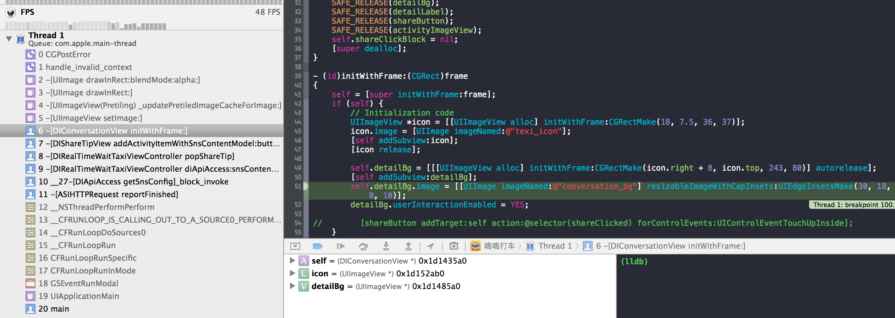

###UIImage resizableImageWithCapInsets CGContextSaveGState: invalid context 0x0
----
###使用UIImage resizableImageWithCapInsets方法时输出如下错误信息:
XCode控制台输出如下错误:

		Oct 23 12:38:34 TMA-1 ResizableImageNullContext[9372] <Error>: CGContextSaveGState: invalid context 0x0. This is a serious error. This application, or a library it uses, is using an invalid context  and is thereby contributing to an overall degradation of system stability and reliability. This notice is a courtesy: please fix this problem. It will become a fatal error in an upcoming update.

###定位控制台中的error:
		
		//按照如下步骤添加breakpoint:
		XCode-->Breakpoint Navigator-->左下角加号--> Add symbolic breakpoint --> Symbol输入框中填写CGPostError。
当错误发生时, 调试器将会停在引发错误的代码处并且可以查看到此时堆栈内的方法调用及参数。 

###错误原因及解决方法:
使用resizableImageWithCapInsets:(UIEdgeInsets)capInsets方法创建可拉伸图片时,   
UIEdgeInsets的top和bottom之和必须小于图片的高度，left与right之和必须小于图片的宽度。
否则resizableImageWithCapInsets方法会认为capInsets不合法，就会在控制台输出错误。
因此,根据原图尺寸重新设定UIEdgeInsets的即可。

###参考链接:
1. [http://www.gcdtech.com/blog/core-graphics-errors-when-calling-uiimage-resizableimagewithcapinsets/](http://www.gcdtech.com/blog/core-graphics-errors-when-calling-uiimage-resizableimagewithcapinsets/)  
2. [http://dushbi.diandian.com/post/2012-12-29/40047780160](http://dushbi.diandian.com/post/2012-12-29/40047780160)
3. [http://stackoverflow.com/questions/19636303/uiimages-resizableimagewithcapinsets-brings-multiple-coregraphics-invalid-cont](http://stackoverflow.com/questions/19636303/uiimages-resizableimagewithcapinsets-brings-multiple-coregraphics-invalid-cont)
4. [http://stackoverflow.com/questions/13183904/invalid-context-when-creating-uiimageview](http://stackoverflow.com/questions/13183904/invalid-context-when-creating-uiimageview)
5. [http://stackoverflow.com/questions/19508048/cgcontext-invalid-context-0x0](http://stackoverflow.com/questions/19508048/cgcontext-invalid-context-0x0)
6. [http://dushbi.diandian.com/post/2012-12-14/40046425674](http://dushbi.diandian.com/post/2012-12-14/40046425674)
7. [http://blog.csdn.net/hong1595/article/details/8961474](http://blog.csdn.net/hong1595/article/details/8961474)
8. [http://code4app.com/requirement/507fe3a66803fac661000000](http://code4app.com/requirement/507fe3a66803fac661000000)
9. [http://www.cnblogs.com/leipei2352/p/3496058.html](http://www.cnblogs.com/leipei2352/p/3496058.html)
10. [http://stackoverflow.com/questions/19276882/error-appears-when-i-type-on-uitextfield-with-physical-keyboard-in-ios7](http://stackoverflow.com/questions/19276882/error-appears-when-i-type-on-uitextfield-with-physical-keyboard-in-ios7)
11. [http://www.cocoachina.com/ask/questions/show/58102/CGContextSaveGState:invalidcontext](http://www.cocoachina.com/ask/questions/show/58102/CGContextSaveGState:invalidcontext)
12. [http://blog.sina.com.cn/s/blog_68ed8b210101cm1d.html](http://blog.sina.com.cn/s/blog_68ed8b210101cm1d.html)
13. [http://blog.csdn.net/like7xiaoben/article/details/8571775](http://blog.csdn.net/like7xiaoben/article/details/8571775)

		

