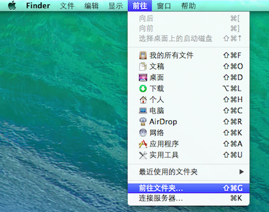

####错误提示
---		
		fatal error: file '/Applications/Xcode5-DP.app/Contents/Developer/Platforms/iPhoneSimulator.platform/Developer/SDKs/iPhoneSimulator7.0.sdk/System/Library/Frameworks/UIKit.framework/Headers/UIDynamicAnimator.h'    
		has been modified since the precompiled header '/Users/sumomochuufuku/Library/Developer/Xcode/DerivedData/ModuleCache/2NEVAP7X943D2/UIKit.pcm' was built
		note: after modifying system headers, please delete the module cache at '/Users/sumomochuufuku/Library/Developer/Xcode/DerivedData/ModuleCache/2NEVAP7X943D2'
   
   
####解决办法      
---   
前往 '/Users/sumomochuufuku/Library/Developer/Xcode/DerivedData/ModuleCache/2NEVAP7X943D2 这个文件夹，删除其文件夹中的内容，然后运行app，没问题了，注意不是删除 2NEVAP7X943D2 文件夹，而是其中的内容。然后再  clean下项目就可以了（product  -> clean）

>注意：   
1. sumomochuufuku 是我的用户名，你要改成你自己的。   
2. NEVAP7X943D2 文件夹应该是对应应用的，所以会随着app的不同而改变，要理解并灵活使用。

